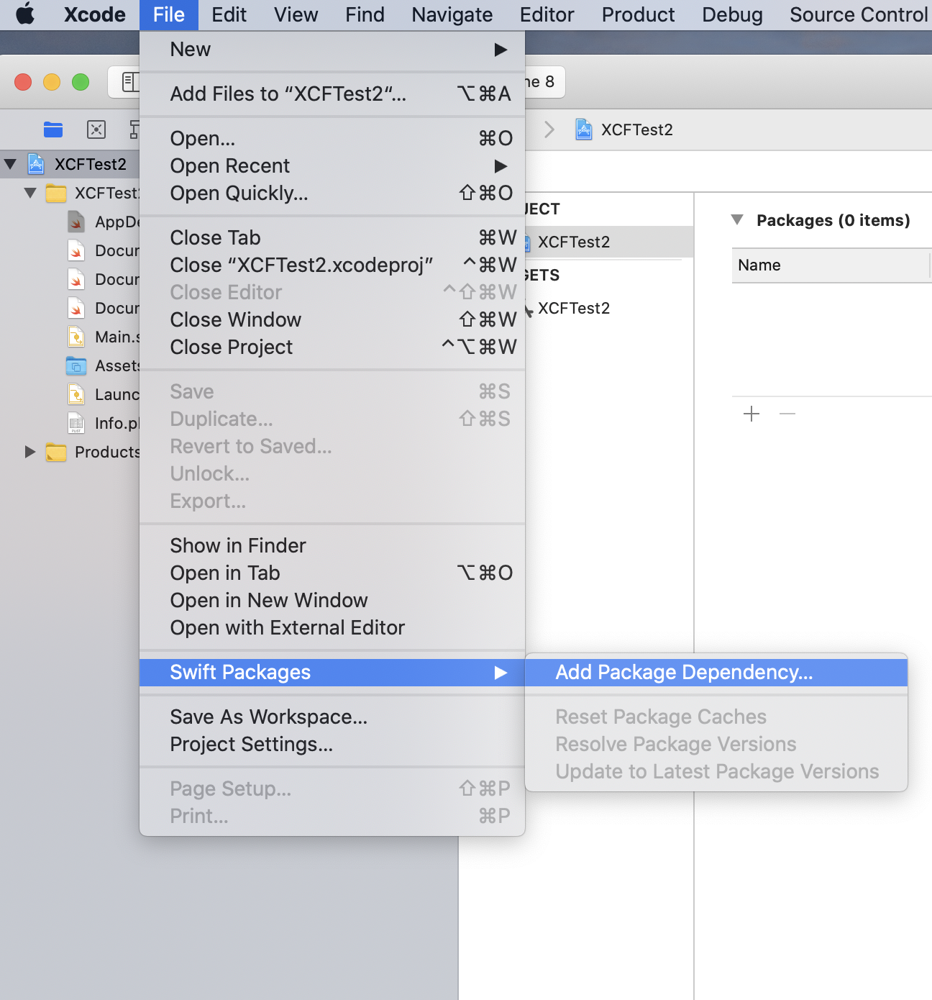
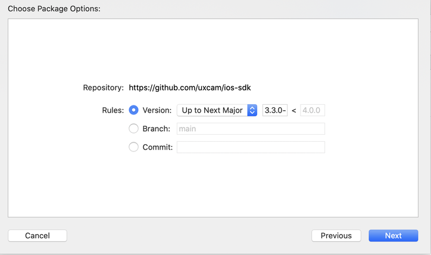
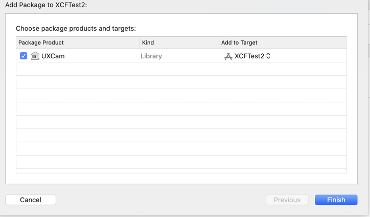

## Using Swift Package Manager

Starting with the 3.3.0 release UXCam for iOS supports installation via [Swift Package Manager](https://swift.org/package-manager/) in Beta status. Please report any problems here.

## Limitations

- Requires Xcode 12.

### In Xcode

File -> Swift Packages -> Add Package Dependency

Select this repository as the URL - https://github.com/uxcam/ios-sdk

Select the version of choice, or just `main` branch to get the latest version.

Choose the targets of your app to link the UXCam package to

